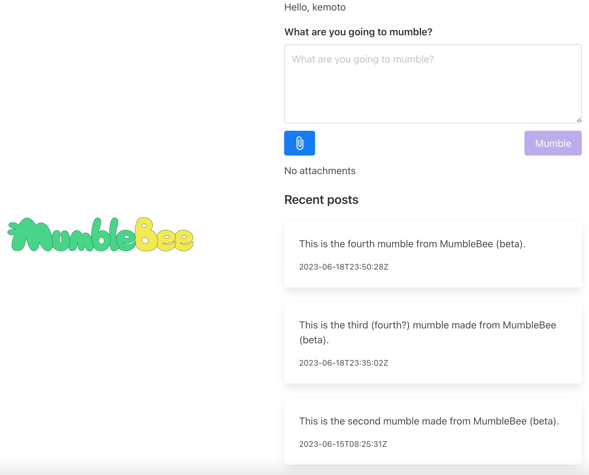

# MumbleBee

MumbleBee is an official client of [Mumble](https://github.com/codemonger-io/mumble).
[Mumble](https://github.com/codemonger-io/mumble) is an implementation of [Activity Pub](https://activitypub.rocks/).
[Activity Pub](https://activitypub.rocks/) is a protocol for decentralized social networking, which [Mastodon](https://joinmastodon.org) also adopts.

## Features

- Sign in to [Mumble](https://github.com/codemonger-io/mumble)
- Publish posts with optional attachments through the [Mumble](https://github.com/codemonger-io/mumble) API

Other features will come in the future.
The UI/UX is subject to change.

### MumbleBee is not

- A hosted service
    - You have to deploy your own MumbleBee configuration.
- A general purpose [Activity Pub](https://activitypub.rocks/) client
    - MumbleBee is dedicated to [Mumble](https://github.com/codemonger-io/mumble).

## Building MumbleBee

MumbleBee is a single page application (SPA) built with [Vue 3](https://v3.vuejs.org/).
Please refer to the [`app` folder](./app) for how to build it.

## Serving MumbleBee on AWS

There is a [AWS Cloud Development Kit (CDK)](https://aws.amazon.com/cdk/) stack that provisions AWS resources for contents delivery.
Please refer to the [`cdk` folder](./cdk) for how to deploy it.

## License

[MIT](./LICENSE)

The following images by [codemonger](https://codemonger.io) are lincensed under [CC BY-SA 4.0](https://creativecommons.org/licenses/by-sa/4.0/):
- ["MumbleBee Brand" (`mumble-bee-brand.png`)](./mumble-bee-brand.png)
- ["MumbleBee Logo" (`favicon.ico`)](./app/public/favicon.ico)